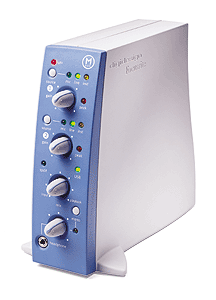

# classy-mbox

Replacement **class-compliant USB Audio firmware** for the Digidesign Mbox 1,
plus a byte-exact reverse engineering of the stock firmware it replaces.

The Mbox 1 (2002) is a good two-channel interface with a Focusrite front end
that stopped being usable when Pro Tools LE moved on and the drivers stopped
being built. It is not broken. It is stranded behind a vendor-specific USB
protocol and a driver nobody ships any more.

This project replaces the firmware in the device's EEPROM with a USB Audio
Class 1 implementation, so the hardware enumerates as a standard audio
interface on **any** OS with no driver, no daemon, and no HAL plug-in.

**Status: working.** Both units here run build `0x0061` and stream 2 ch x 24-bit
at 44.1 and 48 kHz on Linux and macOS, with S/PDIF I/O, front-panel source
selection, and serial numbers served from EEPROM.

---

## The hardware

| part | role |
|---|---|
| **TI TAS1020B** | 8051 core + USB peripheral. Boots from EEPROM into 6016 bytes of program RAM. |
| **AKM AK5383** | 24-bit ADC (capture) |
| **AKM AK4393** | 24-bit DAC (playback) |
| **Cirrus CS8427** | S/PDIF transceiver, on SPI with its chip-select on a GPIO expander |
| **24C64** | 8 KB I2C EEPROM holding the firmware image |

There is **no codec.** Capture and playback are two separate AKM chips. The
name is entrenched in ~170 places across this repo's identifiers and docs
(`codec_write_word`, `g_codec_state_23`) so it has not been mass-renamed --
read it as "the analog front end". Likewise the 16-bit "codec control word" is
two cascaded HEF4094 shift-and-store registers, i.e. a GPIO expander: every bit
is a **pin**, not a register field, which is why it is write-only.

## What works, measured on hardware

- **UAC1 capture and playback**, 2 ch x 24-bit, 44.1 and 48 kHz, both directions.
- **S/PDIF in and out.** The UAC Selector switches analog vs S/PDIF; the front
  panel owns mic/line/instrument, because the S/PDIF swap is a single global bit
  with no panel button while the analog choice is per-channel.
- **Feature Units** with mute, and `GET_MIN`/`MAX`/`RES` on the sample-rate control.
- **Asynchronous endpoints with an explicit feedback endpoint on playback** --
  not a guess. The clock generator free-runs from the crystal, confirmed
  host-side (the two units differ by +4.263 +/- 0.989 ppm) and device-side
  (ACGCAP agrees at +4.53 ppm).
- **Serial numbers in EEPROM**, written over a vendor request at the desk. They
  survive reflashing, because DFU writes exactly `payloadSize` bytes and the
  record lives past the end.
- **Byte-exact recompilation of BOTH stock images.** `link51.py rev20` and
  `rev22` rebuild the original 8174-byte ROMs bit-for-bit from C source.
- **DFU flashers** for macOS (IOKit, Obj-C) and Linux (pyusb), and **41
  verification gates** that run before anything reaches the device.

## Quick start

```sh
tools/setup.sh                        # pre-commit hook + toolchain check
cd mboxfw && make MBOX_PID=0x2000     # -> build/mboxfw_flasher.bin
tools/preflight.sh <image.bin>        # THE gate runner; run this, not individual gates
```

Flashing, Linux:

```sh
sudo tools/mboxflash_linux.py probe | validate | info | flash  [--yes]
```

Flashing, macOS:

```sh
mboxflash [--serial SN] --probe | --enter-dfu | --flash PATH
```

**Build with `MBOX_PID=0x2000`.** At the default `0x1000` the Linux kernel's
`mbox1` quirk claims the device and `snd-usb-audio` never binds, so no ALSA card
appears. `0x2000..0x200F` are audio-mode aliases the flashers understand.

## How it boots, and how DFU works

The TAS1020B boot ROM reads an 18-byte EEPROM header -- signature, checksum,
`dataType`, VID/PID -- copies the image into RAM and jumps to it.

**`dataType` decides the DFU target, and the PID never does.** Both DFU modes
advertise the same `ffff:fffe`-style descriptor set, so the PID alone cannot
tell you which is active:

- `APPCODE` -> run the application.
- readable but not `APPCODE` -> **app-DFU**, which writes EEPROM.
- unreadable EEPROM -> **bulletproof-DFU**, a RAM loader that never writes
  EEPROM. Reachable only from a genuinely dead EEPROM (a real SDA short, a blank
  part).

Entering DFU means invalidating the header **checksum** and power-cycling. A bus
reset is not enough, and a power cycle with a valid image just boots the app.

**Recovery** is `firmware_stock/rev20_flasher_payload.bin` or
`rev22_flasher_payload.bin` -- the stock images, both of which have been written
back to this unit successfully. Flash `safety_net/` first on any device not
already running mboxfw.

## Layout

| path | what |
|---|---|
| `mboxfw/` | the replacement firmware (SDCC/mcs51) |
| `safety_net/` | minimal provably-flashable image, `bcdDevice=0xDEAD` |
| `sigkill/`, `ramflash/`, `ramloader/` | smaller special-purpose images |
| `firmware_stock/` | RE of stock Rev 20 and Rev 22 |
| `firmware_stock/decomp/` | the byte-exact recompilation, and every `FINDING_*.md` |
| `mboxflash/` | macOS flasher (IOKit, Obj-C) |
| `tools/` | Linux flasher, telemetry reader, and ~41 verification gates |
| `plan.md` | the endgame and phase status |
| `POLICY.md` | process rules -- read before touching SFR writes, USB, EEPROM I/O |
| `BRICK_LOG.md` | every soft-brick and its cause |

## Things that are hardware, not bugs

- **The first capture after power-up carries 183 ms of digital silence.** That is
  the AK5383's offset calibration, which costs 8960 LRCK edges and can only be
  spent while a stream is running. Stock pays it on *every* capture.
- **Every capture opens with a small transient** decaying to zero within 400 ms:
  the ADC's high-pass re-converging, because the converter is not clocked
  between streams. Skip the first 400 ms of any measurement.
- **Clean audio about 15 s after power-up**, full behaviour at 30 s. The analog
  reference needs time to settle, and a calibration taken before then latches a
  constant that is wrong by up to 0.12 of full scale.

## How this project works

Two rules do most of the work, and both were learned expensively.

**Every SFR-touching line carries a citation** -- `/* Rev 20 fcn.0xXXXX @ 0xYYYY */`,
a TI source reference, or `/* NOVEL -- reason: ... */`. A pre-commit hook and a
preflight gate verify the cited address actually holds that write, in **both**
stock images. "Stock does it" is a reason to investigate, never on its own a
reason to ship: `GLOBCTL |= 0x02` was shipped on that argument alone and made
the device completely silent on USB.

**Every measurement carries an arm whose answer is known in advance.** A null
from an instrument that was never connected looks exactly like a null from a
refuted hypothesis. Five measurements were voided in a single session because
the stimulus never fired. If the reference arm shows no signal, the run is void,
not interesting.

The corollary is that this repo's `FINDING_*.md` files are dated records, not
living documents, and several of them are superseded. The live inventory is
`firmware_stock/decomp/WHAT_REMAINS_UNKNOWN.md`, which is organised by *why
previous answers were incomplete* rather than as a list of facts.

## What is left

1. **DAW validation.** macOS is confirmed at the CLI -- enumeration, serial,
   Selector, exact-length capture, playback. Logic is untested, and it is the
   actual use case. This is the only item on the critical path.
2. **A 16-bit alternate setting.** No modern host wants it; Mac OS 9's Sound
   Manager needs it. The mechanism is the DMA slot size (`DMATSL 0x03 -> 0x02`
   plus the endpoint BPS field), with the C-port untouched. One bench
   measurement gates it: whether the DMA takes the first two bytes of each slot
   (the MSBs -- a clean truncation) or the last two.
3. Two parked items: the EP0 Y-count at boot-ROM handoff, and naming the vendor
   part behind the codec control word.

## Credit and status

This is a personal project on hardware I own, developed against two units. The
stock firmware RE exists to make the replacement defensible -- every divergence
from stock is justified in a machine-read table that a gate checks -- and it
turned out to be worth having on its own.

Header image: Digidesign Mbox press photo.
